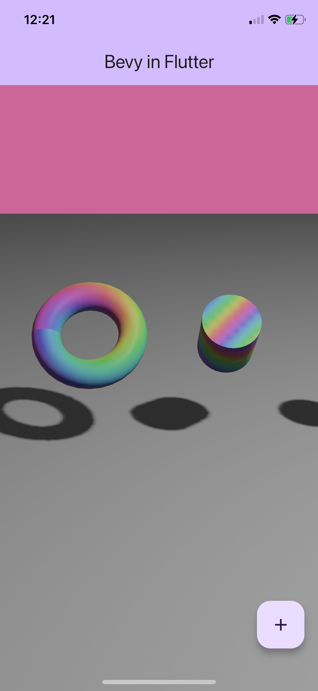

# Bevy in Flutter

A quick and dirty demo showing how you can integrate [Bevy](https://bevyengine.org) into a [Flutter](https://flutter.dev) app. The demo only works on iOS for now, but the same approach should work fine on Android. 

All of the clever stuff is taken from this repo: https://github.com/jinleili/bevy-in-app

All I’ve done is put jinleili’s code in a platform view in a Flutter app. Not too hard to do, but I thought worth publishing as a proof of concept.

## Build instructions

From the `bevy` directory, run `sh ios_build.sh --release`.

Then, from the `flutter` directory, run `flutter run --release` and run it on a physical device. 

## Screenshot

## Performance

I initially avoided using platform views because the documentation seemed to suggest that the performance was bad, but after watching [Dominik Roszkowski’s talk](https://www.youtube.com/watch?v=OWCOv19o9eQ) I was convinced to give it a go. I haven’t done any extensive performance testing yet, but my initial impressions are that it doesn’t seem to be an issue, at least not for a non-scrollable view with a couple of controls overlayed. 

The documentation says “embedding iOS views is an expensive operation”, so I thought maybe the start-up time would be poor, but in fact it’s great. And we’re loading a whole game engine on start-up, so that’s really not too shabby.
